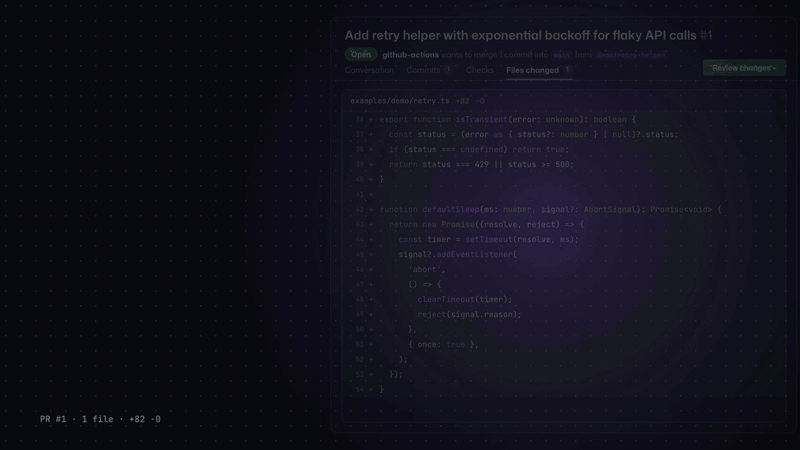
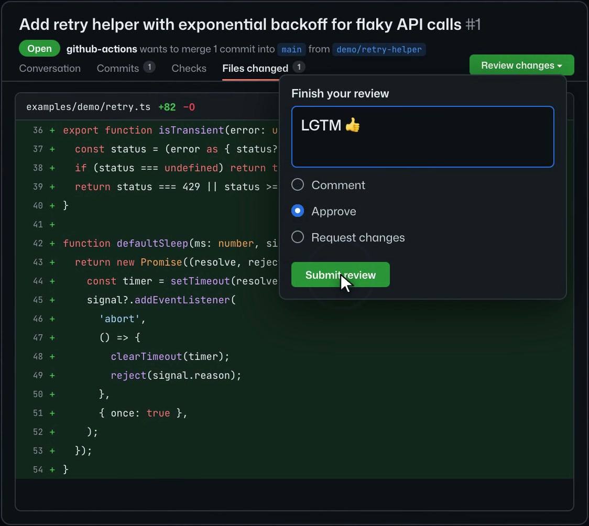
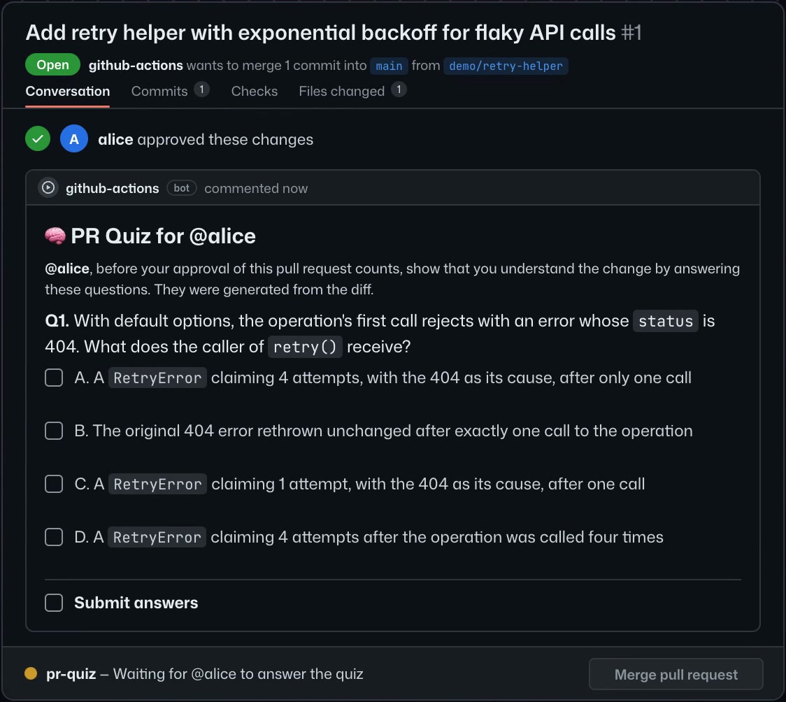
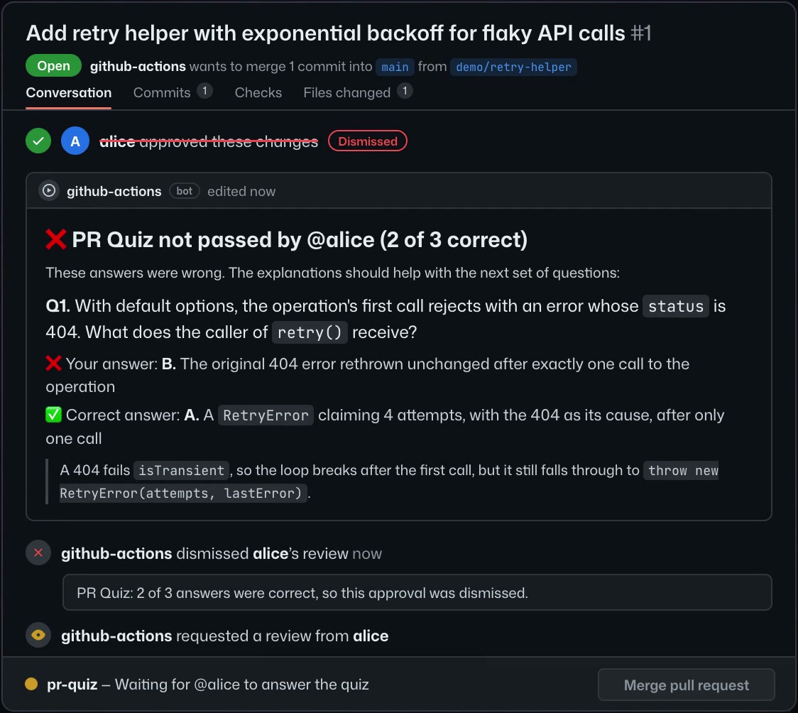
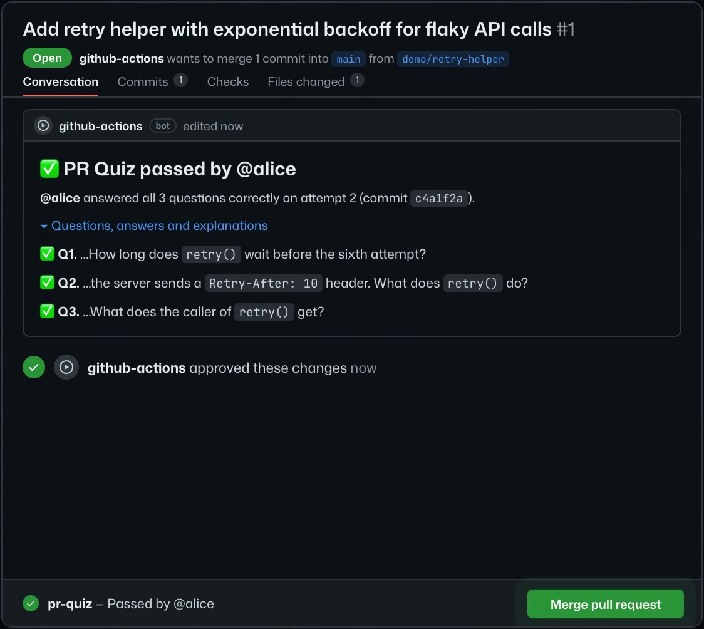
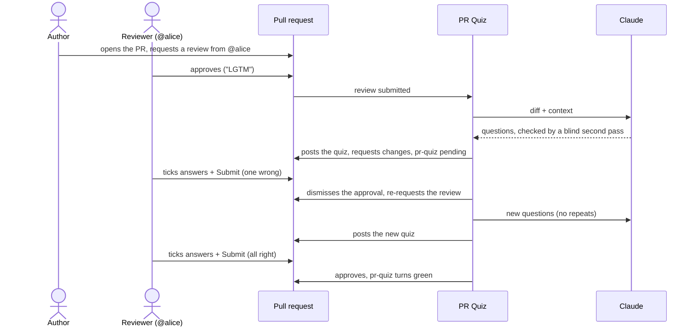

<div align="center">

<a href="docs/media/pr-quiz-demo.mp4"></a>

# PR Quiz

**Approvals that prove understanding.**

A GitHub Action that won't let an approval count until the reviewer passes a short quiz<br>
that Claude writes about the diff. One wrong answer and the approval is dismissed.

[](https://github.com/michaelbeutler/pr-quiz/actions/workflows/ci.yml)
[](action.yml)
[](#2-connect-claude)


[**▶ Demo video with sound** (MP4)](docs/media/pr-quiz-demo.mp4) · [Quick start](#quick-start) · [How it works](#how-it-works) · [Configuration](#configuration)

</div>

---

AI writes more of our code every day, and a quick **LGTM** is often the only human check it gets.
PR Quiz makes that check count: when someone approves a pull request, a bot posts a few multiple-choice
questions about what the change actually does. The approval only counts once the reviewer ticks the right
answers.

## See it in action

<table>
  <tr>
    <td width="50%"></td>
    <td width="50%"></td>
  </tr>
  <tr>
    <td><b>1. The usual.</b> The reviewer skims, types "LGTM" and approves.</td>
    <td><b>2. The quiz.</b> The bot posts questions Claude wrote from the diff. The <code>pr-quiz</code> check waits.</td>
  </tr>
  <tr>
    <td></td>
    <td></td>
  </tr>
  <tr>
    <td><b>3. One wrong answer.</b> The approval is dismissed, the review re-requested, and the right answer explained.</td>
    <td><b>4. New questions, right answers.</b> The bot approves and <code>pr-quiz</code> turns green.</td>
  </tr>
</table>

<sub>Frames from the demo video. The questions are the ones Claude generated in a real test run on this repository; the reviewer's name is a stand-in.</sub>

<details>
<summary>What the quiz comment looks like in Markdown</summary>

```markdown
## 🧠 PR Quiz for @alice

@alice, before your approval of this pull request counts, show that you understand the change by answering
these questions. They were generated from the diff.

**Q1.** With this change, a GET request made by `ky.create({retry: 0}).extend({retry: {methods: ['get']}})`
gets a 408 response every time. How many attempts does ky make, and why?
<sub>📄 `source/utils/merge.ts`</sub>

- [ ] A. Three attempts: the recursive merge skips the numeric parent value, so only `{methods: ['get']}` remains…
- [ ] B. Three attempts: `0` is falsy, so the expansion is skipped and the default limit of 2 is used…
- [ ] C. One attempt: `0` passes the `typeof === 'number'` check, so it becomes `{limit: 0}`…
- [ ] D. Four attempts: the expansion adds the default limit to the parent's `0`…

…

- [ ] **Submit answers**
```

A real question Claude generated for [sindresorhus/ky#867](https://github.com/sindresorhus/ky/pull/867);
`npm run smoke -- sindresorhus/ky 867` reproduces it.

</details>

## The flow



<details>
<summary>The same flow, step by step</summary>

1. Someone opens a pull request and asks **@alice** for a review.
2. @alice reviews the code.
3. @alice approves.
4. The bot posts a quiz for @alice (GitHub checkboxes, one answer per question plus **Submit answers**) and
   submits a **Changes requested** review, so it shows up in the reviewer list as blocking. The `pr-quiz`
   commit status is `pending`.
5. @alice ticks their answers and **Submit answers**. One is wrong.
6. The bot dismisses @alice's approval and re-requests their review. The graded quiz shows which answers were
   wrong, with explanations.
7. The bot posts new questions (Claude is told not to repeat the old ones).
8. @alice answers everything correctly.
9. The bot **approves** on their behalf and `pr-quiz` turns green.

Run `npm run simulate` to watch this exact sequence against an in-memory GitHub and see every comment the
bot writes.

</details>

## Quick start

### 1. Add the workflow

Copy [`examples/pr-quiz.yml`](examples/pr-quiz.yml) to `.github/workflows/pr-quiz.yml` in the repository you
want to protect. It uses `michaelbeutler/pr-quiz@v1` (see [Publishing](#publishing) for creating the `v1`
tag).

### 2. Connect Claude

Pick one and store it as a repository or organization secret:

| Secret | What it is | How to get it |
| --- | --- | --- |
| `CLAUDE_CODE_OAUTH_TOKEN` | Your Claude subscription (Pro/Max/Team/Enterprise). Questions are generated by the Claude Code CLI, which the action installs on the runner. | Run `claude setup-token` locally and paste the token. If you already ran `/install-github-app` in Claude Code, this secret may already exist. |
| `ANTHROPIC_API_KEY` | An Anthropic API key, billed per token. Faster (no CLI install) and takes precedence when both are set. | [console.anthropic.com](https://console.anthropic.com) → API keys. |

### 3. Let the bot approve

With the default `GITHUB_TOKEN`, the bot is `github-actions[bot]`. Allow it to approve:
**Settings → Actions → General → Workflow permissions → "Allow GitHub Actions to create and approve pull
requests"** (for organization repositories, enable it in the organization settings first).

Without this setting everything still works; the bot just can't submit its final approval, so it withdraws
its blocking review instead and the commit status carries the result.

### 4. Make the gate required

In a branch ruleset (or classic branch protection) for your default branch:

- **Require status checks to pass** → add `pr-quiz`. This is the gate that reliably blocks merging.
- Optionally **Require a pull request before merging** with 1 required approval. The bot's approval counts,
  and its *Changes requested* review blocks while a quiz is pending. Because the bot's approval counts, require
  N + 1 approvals if you want N human approvals, or set `submit-reviews: false`.

<details>
<summary>Optional: give the bot its own name with a GitHub App</summary>

To have the bot appear as e.g. `pr-quiz[bot]` instead of `github-actions[bot]`, create a GitHub App with
*Pull requests*, *Issues* and *Commit statuses* read/write and *Contents* read-only permissions, install it on
the repository, and pass its token:

```yaml
    steps:
      - id: app
        uses: actions/create-github-app-token@v3
        with:
          app-id: ${{ vars.PR_QUIZ_APP_ID }}
          private-key: ${{ secrets.PR_QUIZ_APP_KEY }}
      - uses: michaelbeutler/pr-quiz@v1
        with:
          github-token: ${{ steps.app.outputs.token }}
          claude-code-oauth-token: ${{ secrets.CLAUDE_CODE_OAUTH_TOKEN }}
```

App approvals do not need the setting from step 3. Edits made by an App token trigger workflows; the job's
`sender.type != 'Bot'` filter and the idempotent design keep that from looping. A dedicated App is also the
first step of the hardening described under [Limitations](#limitations).

</details>

## For reviewers

- Tick **exactly one** answer per question, then tick **Submit answers**.
- Only you can answer your quiz. If anyone else ticks a box in it (including the PR author), the quiz is
  invalidated and reposted with the same questions, without counting as an attempt.
- A wrong answer dismisses your approval, re-requests your review, and posts new questions. The old quiz
  shows the correct answers and explanations.
- To take a quiz without approving first, comment `/pr-quiz`. This is also how quizzes work on pull
  requests from forks (see [Limitations](#limitations)).
- The PR author and anyone who authored or committed one of its commits can't take the quiz; their
  approvals neither pass nor block the gate.
- If new commits change the code after you passed, and your approval is still active, you get a short
  follow-up quiz about the files that changed. A rebase that doesn't change the diff keeps your pass.
- Changes a quiz can't cover (ignored files like lockfiles, binary files, diffs too large for GitHub to show)
  never pass silently. Once you passed, such a change only needs you to approve the latest commit again; a PR
  consisting only of such changes needs an approval of its latest commit instead of a quiz.

## Configuration

| Input | Default | Description |
| --- | --- | --- |
| `anthropic-api-key` | | Anthropic API key. |
| `claude-code-oauth-token` | | Claude subscription token from `claude setup-token`. |
| `model` | `claude-opus-5-5` | Model that writes and verifies the questions. `claude-sonnet-5-5` is cheaper. |
| `effort` | `high` | Reasoning effort: `low`, `medium`, `high`, `xhigh`, `max`. |
| `questions` | `3` | Questions per quiz (1-10). |
| `options-per-question` | `4` | Answer options per question (3-6). |
| `verify-questions` | `true` | A second, blind Claude pass answers each question and drops ones it gets wrong or finds ambiguous. Roughly doubles token usage. |
| `require-all-approvers` | `true` | `true`: every current approver must pass. `false`: one passing reviewer is enough. |
| `max-attempts` | `5` | Failed attempts per reviewer per PR before no new quiz is generated (`0` = unlimited). |
| `submit-reviews` | `true` | Bot submits *Changes requested* while a quiz is pending and *Approve* once it passes. |
| `status-context` | `pr-quiz` | Name of the commit status to require. |
| `command` | `/pr-quiz` | Comment command to request a quiz. If you change it, change the `startsWith` filter in the workflow too. |
| `ignore-paths` | | Extra globs to leave out of the quiz, comma or newline separated. Lockfiles, minified files, source maps and snapshots are always ignored. |
| `max-diff-chars` | `200000` | Diff budget sent to Claude; bigger diffs are truncated per file. |
| `include-file-context` | `true` | Also send the full post-change contents of modified files (within budget). |
| `extra-instructions` | | Extra guidance for the question writer, e.g. `Focus on security` or `Write the questions in German`. |
| `state-secret` | derived | Key for encrypting the answer key. Defaults to a key derived from the Claude credential; set it if you rotate credentials often (open quizzes become unreadable after a key change and are regenerated). |
| `github-token` | `github.token` | Token for all GitHub calls. |
| `pr-number` | | Pull request to reconcile on `workflow_dispatch`. |
| `claude-code-version` | `stable` | Claude Code version installed when using the OAuth token and `claude` is not on `PATH`. |

Outputs: `gate` (`passed`, `pending`, `error`, `skipped`) and `actions` (JSON list of what the bot did).
Every run also writes a job summary.

## How it works

- **Stateless and idempotent.** Every event (approval, checkbox tick, push, `/pr-quiz`) triggers a full
  reconciliation against GitHub's current state: reviews, quiz comments, the diff. Missed, duplicated or
  reordered webhook events can't desync it, and a failed run is simply retried by the next event.
- **Secret answer key.** Each quiz comment carries its state (questions, correct answers, explanations,
  reviewer, attempt history, diff fingerprints) in an HTML comment, encrypted with AES-256-GCM and bound to
  the repository, the pull request and the comment itself. Reading the comment's source reveals nothing,
  and a blob can't be edited, forged, or copied into another comment or PR.
- **No replays.** GitHub keeps every revision of a comment, including the open version of a quiz whose
  answers were later revealed. Before touching an open quiz, the bot checks that its state is exactly the one
  in the bot's own latest revision of that comment; pasted or rolled-back state is undone, and a quiz whose
  history was pruned is closed without reusing its questions.
- **Only the reviewer's ticks count.** Ticking a checkbox edits the comment, and GitHub records who made
  each edit. At submission, the bot reads the comment's edit history and rejects the quiz if anyone other
  than the reviewer or the bot edited it.
- **History you can't delete away.** Every new quiz carries the reviewer's failed-attempt count and the
  questions they have already seen, so deleting old quiz comments neither resets `max-attempts` nor brings
  back questions whose answers were shown.
- **Questions worth answering.** Claude is asked for questions about behavior, edge cases, risks and
  intent-vs-implementation, with plausible distractors of the same length and detail as the right answer.
  The bot shuffles the options itself, so the model can't be steered into a predictable answer position.
  With `verify-questions`, a blind second pass must reproduce every answer key.
- **Untrusted input stays data.** The PR title, description and code are wrapped as untrusted input; Claude
  is told to ignore instructions inside them. The action never checks out or runs PR code. Claude Code runs
  with all tools disabled, in an empty directory, with a minimal environment.
- **New commits.** The diff fingerprint ignores hunk line numbers, so rebases keep passes. Real changes make
  open quizzes outdated; approvers with an active approval get a follow-up quiz about the changed files.
  Retargeting the PR to another base branch is re-evaluated the same way.
- **Refusals and errors.** On the API path with Claude Opus 5.5, server-side fallbacks (`fallbacks: "default"`)
  retry a request that a safety classifier declined (for example security-heavy code) on Anthropic's
  recommended fallback model. If generating a quiz still fails, the status shows the error and the bot
  retries on the next approval, push or `/pr-quiz`, not on every checkbox tick.

## Cost

Measured with `claude-opus-5-5` at `high` effort, 3 questions, verification on: about **$0.35–0.70 per quiz**
for small-to-medium PRs (two calls, the second largely served from the prompt cache on the API path),
around a minute of runtime. With a subscription token it uses your plan's quota instead. To reduce cost,
use `model: claude-sonnet-5-5`, `effort: medium`, or `verify-questions: false`.

## Limitations

- **Bots can't be requested reviewers on GitHub.** The bot therefore shows up in the reviewer list through
  its own *Changes requested* review ("pending") and later its *Approve* review. GitHub also doesn't let the
  bot review a pull request it opened itself; the `pr-quiz` status still gates those.
- **Pull requests from forks:** review events from forks run without secrets or write access, so an approval
  there doesn't start a quiz. Reviewers comment `/pr-quiz` instead (comment events always run in the base
  repository). Pushes to fork PRs are handled normally via `pull_request_target`.
- **Threat model.** The anti-cheat measures cover reviewers and authors acting through GitHub with their own
  accounts: ticking someone else's quiz, pasting or rolling back quiz state, pruning edit history, deleting
  old quizzes. They don't stop someone who can run workflows. With the default `GITHUB_TOKEN`, every workflow
  in the repository acts as `github-actions[bot]`, the same identity as the quiz bot, and anyone with write
  access can push a workflow that edits quiz comments as the bot or sets the `pr-quiz` status directly. To
  harden it: use a dedicated GitHub App as the bot (edits by other workflows then count as someone else's),
  select that App as the required source of the `pr-quiz` check in your ruleset, and protect
  `.github/workflows/**` with CODEOWNERS and a ruleset so workflow changes need review.
- Deleting every quiz comment of a reviewer resets their attempt history; deleting only some doesn't.
- An LLM can still write a flawed question. The blind verification pass catches most of these, the graded
  quiz shows the explanation, and a failed attempt only costs a new set of questions.
- GitHub lists at most 3000 files per PR; very large PRs are quizzed on what fits into `max-diff-chars`.

## Development

```bash
npm ci
npm test            # unit tests + end-to-end flows against an in-memory GitHub
npm run typecheck
npm run simulate    # narrated walk-through of the 9-step flow
GITHUB_TOKEN=$(gh auth token) npm run smoke -- sindresorhus/ky 880   # real quiz from Claude for a public PR
npm run build       # bundles to dist/index.cjs, which GitHub runs; commit it
```

`npm run smoke` uses `ANTHROPIC_API_KEY` when set, otherwise your local Claude Code login.

### Publishing

GitHub runs the committed bundle, so run `npm run build` and commit `dist/` before tagging:

```bash
git tag v1.0.0 && git tag -f v1 && git push origin v1.0.0 v1 --force
```

Consumers then use `uses: michaelbeutler/pr-quiz@v1`.

---

<sub>Demo video made with <a href="https://hyperframes.heygen.com">HyperFrames</a>.
Music: "Happy Beats / Business Moves Vol. 1" by <a href="https://ende.app/en">ende.app</a>.</sub>
